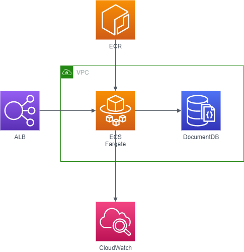

# Phoenix Application Problem
This problem is about to create a production ready infrastructure for the Phoenix Application.

## Problem

The development team has released the phoenix application code.
Your task, if you want to accept it, is to create the production infrastructure
for the Phoenix application. You must pay attention to some unwanted features
that were introduced during development. In particular:

- `GET /crash` kill the application process
- `GET /generatecert` is not optimized and creates resource consumption peaks

## General Requirements

- You may use whatever programming language/platform you prefer. Use something that you know well.
- You must release your work with an OSI-approved open source license of your choice.
- You must deliver the sources, with a README that explains how to run it.
- Add the code to your own Github account and send us the link.

## Application Requirements

- Runs on Node.js 8.11.1 LTS
- MongoDB as Database
- Environment variables:
    - PORT - Application HTTP Exposed Port
    - DB_CONNECTION_STRING - Database connection string `mongodb://[username:password@]host1[:port1][,host2[:port2],...[,hostN[:portN]]][/[database][?options]]`

## Run Application
- Install dependencies `npm install`
- Run `npm start`
- Connect to `http://<hostname|IP>:<ENV.PORT>`

## Problem Requirements

1. Automate the creation of the infrastructure and the setup of the application.
2. Recover from crashes. Implement a method autorestart the service on crash
3. Backup the logs and database with rotation of 7 days
4. Notify any CPU peak
5. Implements a CI/CD pipeline for the code
6. Scale when the number of request are greater than 10 req /sec


# Solution

## Architecture




## Requirements

| Requirement                                                                  | Solution                  | 
|------------------------------------------------------------------------------|---------------------------|
| Automate the creation of the infrastructure and the setup of the application.| CloudFormation template   | 
| Recover from crashes. Implement a method autorestart the service on crash    | ECS HealthCheck           | 
| Backup the logs and database with rotation of 7 days                         | CloudWatch retention      | 
| Notify any CPU peak                                                          | CloudWatch metrics        | 
| Implements a CI/CD pipeline for the code                                     | CodePipeline suite        | 
| Scale when the number of request are greater than 10 req /sec                | ECS custom scaling policy | 

## Assumptions

- to keep the release pipeline easier Fargate task definition will be created using CloudFormation and not managed in the release pipeline
- source code will be on CodeCommit

## Environment set-up

All following command can be scripted or managed with a cloudformation template

### VPC

```shell script
aws cloudformation deploy --stack-name network --template-file infrastructure/vpc.yaml --parameter-overrides `
Name=test-network `
VpcCIDR=10.215.0.0/16 `
Subnet1CIDR=10.215.10.0/24 `
Subnet2CIDR=10.215.20.0/24 `
--capabilities CAPABILITY_NAMED_IAM `
--profile certification --region eu-west-1
```

### ALB

```shell script
aws cloudformation deploy --stack-name alb --template-file infrastructure/load-balancer.yaml --parameter-overrides `
LaunchType=Fargate `
Subnets=subnet-0b0f3a2b3c698c01e,subnet-06473ceff4e04ecc3 `
VpcId=vpc-035fc1689a8cb647d `
--capabilities CAPABILITY_NAMED_IAM ``
```

### ECS

```shell script
aws cloudformation deploy --stack-name ecs-cluster --template-file infrastructure/ecs-cluster.yaml --parameter-overrides `
LaunchType=Fargate `
SourceSecurityGroup=sg-03b94c23327376219 `
Subnets=subnet-0b0f3a2b3c698c01e,subnet-06473ceff4e04ecc3 `
VpcId=vpc-035fc1689a8cb647d `
--capabilities CAPABILITY_NAMED_IAM ``
--profile certification --region eu-west-1
```

TODO create first image on ECR

```shell script
aws cloudformation deploy --stack-name ecs-service --template-file infrastructure/service.yaml --parameter-overrides `
Cluster=ecs-cluster `
LaunchType=Fargate `
TargetGroup=arn:aws:elasticloadbalancing:eu-west-1:755742336600:targetgroup/alb-TargetG-UTH1KMYVW7ZA/7f528b3dd9a3358d `
SourceSecurityGroup=sg-03b94c23327376219 `
Subnets=subnet-0b0f3a2b3c698c01e,subnet-06473ceff4e04ecc3 `
--capabilities CAPABILITY_NAMED_IAM ``
```

### CodePipeline

```shell script
aws cloudformation deploy --stack-name deployment-pipeline --template-file infrastructure/deployment-pipeline.yaml --parameter-overrides `
Cluster=ecs-cluster `
Service=arn:aws:ecs:eu-west-1:755742336600:service/ecs-cluster/ecs-service-FargateService-QFdMvaR91bAU `
Repo=pfusari-ecs `
Branch=master `
--capabilities CAPABILITY_NAMED_IAM `
```

# References 
- https://github.com/aws-samples/ecs-refarch-cloudformation/tree/master/services
- https://github.com/awslabs/ecs-refarch-continuous-deployment
- https://docs.aws.amazon.com/elasticloadbalancing/latest/application/load-balancer-cloudwatch-metrics.html
- https://docs.amazonaws.cn/en_us/AmazonECS/latest/developerguide/taskdef-envfiles.html
- https://docs.aws.amazon.com/codepipeline/latest/userguide/tutorials-ecs-ecr-codedeploy.html
- https://github.com/aws-samples/ecs-blue-green-deployment/tree/fargate
- https://docs.aws.amazon.com/AWSCloudFormation/latest/UserGuide/aws-properties-ecs-taskdefinition-containerdefinitions.html