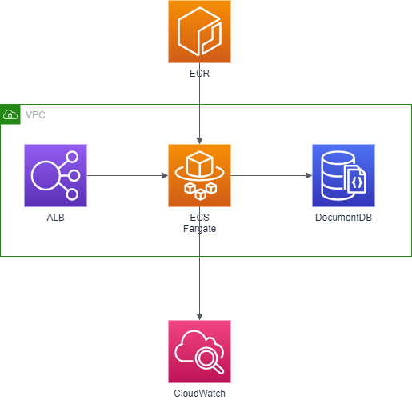

# Phoenix Application Problem
This problem is about to create a production ready infrastructure for the Phoenix Application.

## Problem

The development team has released the phoenix application code.
Your task, if you want to accept it, is to create the production infrastructure
for the Phoenix application. You must pay attention to some unwanted features
that were introduced during development. In particular:

- `GET /crash` kill the application process
- `GET /generatecert` is not optimized and creates resource consumption peaks

## General Requirements

- You may use whatever programming language/platform you prefer. Use something that you know well.
- You must release your work with an OSI-approved open source license of your choice.
- You must deliver the sources, with a README that explains how to run it.
- Add the code to your own Github account and send us the link.

## Application Requirements

- Runs on Node.js 8.11.1 LTS
- MongoDB as Database
- Environment variables:
    - PORT - Application HTTP Exposed Port
    - DB_CONNECTION_STRING - Database connection string `mongodb://[username:password@]host1[:port1][,host2[:port2],...[,hostN[:portN]]][/[database][?options]]`

## Run Application
- Install dependencies `npm install`
- Run `npm start`
- Connect to `http://<hostname|IP>:<ENV.PORT>`

## Problem Requirements

1. Automate the creation of the infrastructure and the setup of the application.
2. Recover from crashes. Implement a method autorestart the service on crash
3. Backup the logs and database with rotation of 7 days
4. Notify any CPU peak
5. Implements a CI/CD pipeline for the code
6. Scale when the number of request are greater than 10 req /sec


# Solution

## Architecture

Following the architecture overview 



Following the Release change pipelie architecture overview


## Requirements

| Requirement                                                                  | Solution                  | 
|------------------------------------------------------------------------------|---------------------------|
| Automate the creation of the infrastructure and the setup of the application.| CloudFormation template   | 
| Recover from crashes. Implement a method autorestart the service on crash    | ECS HealthCheck           | 
| Backup the logs and database with rotation of 7 days                         | CloudWatch retention      | 
| Notify any CPU peak                                                          | CloudWatch metrics        | 
| Implements a CI/CD pipeline for the code                                     | CodePipeline suite        | 
| Scale when the number of request are greater than 10 req /sec                | ECS custom scaling policy | 

## Assumptions

- to keep the release pipeline easier Fargate task definition will be created using CloudFormation and not managed in the release pipeline
- source code will be on CodeCommit
- container DB_CONNECTION_STRING environment variable will be stored as plain text, in future release it's recommended to use Secret Manager service 
to manage secret and retrieve directly from code

## Environment set-up

All following commands can be scripted or managed with a cloudformation template avoiding manual copy and paste

### VPC

```shell script
aws cloudformation deploy --stack-name network --template-file infrastructure/vpc.yaml --parameter-overrides `
Name=$env:APPLICATION_NAME `
--capabilities CAPABILITY_NAMED_IAM 
```

### ALB

where SUBNET and VPC can be retrieved from CloudFormation network stack

```shell script
aws cloudformation deploy --stack-name alb --template-file infrastructure/load-balancer.yaml --parameter-overrides `
LaunchType=Fargate `
Subnets=$env:SUBNETS `
VpcId=$env:VPC `
--capabilities CAPABILITY_NAMED_IAM 
```

### Database

where VPC and DB_SUBNET_GROUP can be retrieved from CloudFormation network stack. 
For simplicity default value for username and password will be used, for production enforce security on secrets

```shell script
aws cloudformation deploy --stack-name documentDB --template-file infrastructure/database.yaml --parameter-overrides `
VpcId=$env:VPC `
DocDBSubnetGroup=$env:DB_SUBNET_GROUP `
--capabilities CAPABILITY_NAMED_IAM 
```

### ECS

where SUBNET and VPC can be retrieved from CloudFormation network stack
where SECURITY_GROUP can be retrieved from CloudFormation alb stack

```shell script
aws cloudformation deploy --stack-name ecs-cluster --template-file infrastructure/ecs-cluster.yaml --parameter-overrides `
LaunchType=Fargate `
SourceSecurityGroup=$env:SECURITY_GROUP `
Subnets=$env:SUBNETS `
VpcId=$env:VPC `
--capabilities CAPABILITY_NAMED_IAM 
```

Manually create first image

```shell script
$(aws ecr get-login --region $env:REGION --no-include-email)
docker build -t $env:REPOSITORY_URI:latest .
docker push $REPOSITORY_URI:latest
```

where SUBNET can be retrieved from CloudFormation network stack
where SECURITY_GROUP and TARGET_GROUP can be retrieved from CloudFormation alb stack
where ECS_CLUSTER can be retrieved from CloudFormation ecs-cluster stack

```shell script
aws cloudformation deploy --stack-name ecs-service --template-file infrastructure/service.yaml --parameter-overrides `
Cluster=$env:ECS_CLUSTER `
LaunchType=Fargate `
TargetGroup=$env:TARGET_GROUP `
SourceSecurityGroup=$env:SECURITY_GROUP `
Subnets=$env:SUBNETS `
EcrRepository=$env:ECR_REPOSITORY `
DBUser=$env:DBUser `
DBPassword=$env:DBPassword `
DBEndpoint=$env:DBEndpoint `
--capabilities CAPABILITY_NAMED_IAM 
```

### CodePipeline

where ECS_CLUSTER and ECR_REPOSITORY can be retrieved from CloudFormation ecs-cluster stack
where ECS_SERVICE can be retrieved from CloudFormation ecs-service stack

```shell script
aws cloudformation deploy --stack-name deployment-pipeline --template-file infrastructure/deployment-pipeline.yaml --parameter-overrides `
Cluster=$env:ECS_CLUSTER `
Service=$env:ECS_SERVICE `
Repo=$env:REPO `
Branch=$env:BRANCH `
EcrRepository=$env:ECR_REPOSITORY `
--capabilities CAPABILITY_NAMED_IAM 
```

# References 
- https://github.com/aws-samples/ecs-refarch-cloudformation/tree/master/services
- https://github.com/awslabs/ecs-refarch-continuous-deployment
- https://docs.aws.amazon.com/elasticloadbalancing/latest/application/load-balancer-cloudwatch-metrics.html
- https://docs.amazonaws.cn/en_us/AmazonECS/latest/developerguide/taskdef-envfiles.html
- https://docs.aws.amazon.com/codepipeline/latest/userguide/tutorials-ecs-ecr-codedeploy.html
- https://github.com/aws-samples/ecs-blue-green-deployment/tree/fargate
- https://docs.aws.amazon.com/AWSCloudFormation/latest/UserGuide/aws-properties-ecs-taskdefinition-containerdefinitions.html
- https://computingforgeeks.com/create-amazon-documentdb-database-on-aws/
- https://github.com/aws-samples/amazon-documentdb-serverless-samples